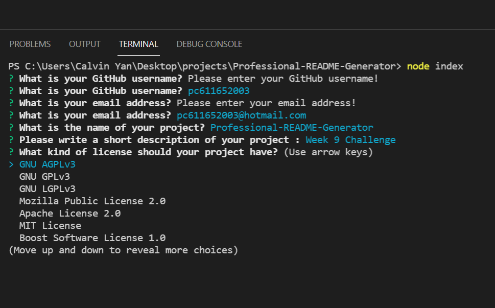
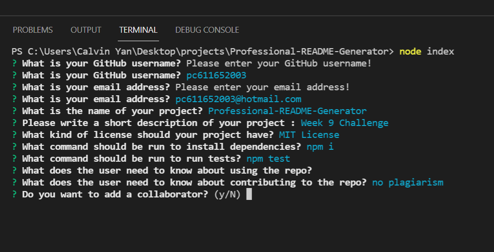
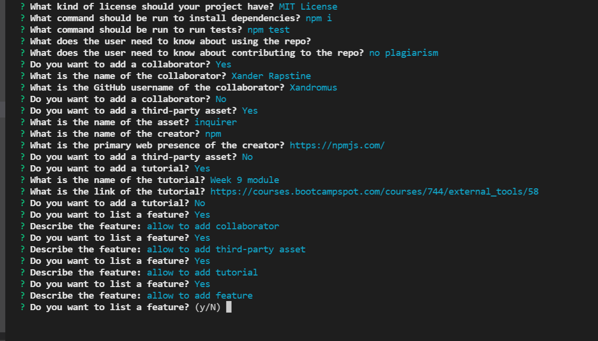
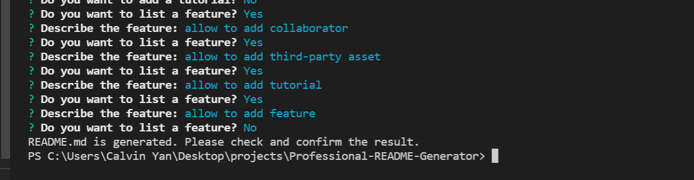

# Professional README Generator

Video Link: https://watch.screencastify.com/v/LNrgJAlpRPkTB3Yh5ihT

Repository: https://github.com/pc611652003/Professional-README-Generator

Generated README.md: https://github.com/pc611652003/Professional-README-Generator/blob/main/README.md

Application README: https://github.com/pc611652003/Professional-README-Generator/blob/main/README2.md

## Screenshot

The application will be launched by using command 'node index'.
It will ask user to input GitHub username, email, project name, description of the project.
Then it will ask user to choose 1 of the license from the list.

After choosing license, user will be asked to input commands for installation and testing.
User also will be ask to describe what is need to know about using the repo or contributing to the repo.
Then, user will be ask for additional details

For additional details, user will be asked for info of collaborators, third-party assets, tutorials, and features.
User can repeatingly add these info until answering no.

After user finished inputting features, the application will alert user when the README file is ready for review.
